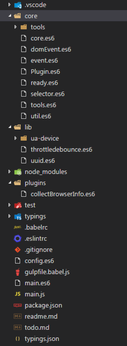
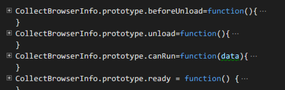
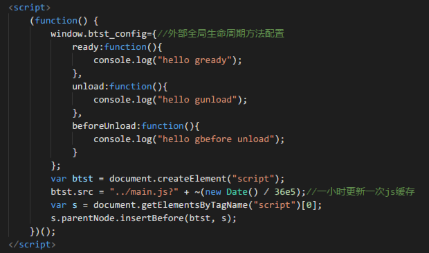

[](https://travis-ci.org/charlenezell/btst)

# 读我

<!-- TOC -->

- [读我](#读我)
    - [目录结构](#目录结构)
    - [构建](#构建)
    - [扩展](#扩展)

<!-- /TOC -->

## 目录结构



1. core 包含框架的各种核心功能，domEvent,订阅者事件机制，插件类，domReady的实现，语法功能util，通用功能的tools，由于tools可能会日后继续扩展所以作为一个文件夹存在。

1. lib 包含第三方的实现baidu的ua-device用于ua判断，throttledebounce用于函数异步化，uuid用于生产uuid v4的字符串。

1. plugins 是btst的扩展部分，每个业务或者功能点可以拆开放在这个目录里面，以core里面的Plugin为模板创建扩展，方式是约定方法名注入到core里面btst的生命周期里面。

1. test 这个是demo的目录

1. 其他 不做详细解释

## 构建

1.使用gulp@4.x+browserify构建出根目录下的main.js供外部使用

```shell
    #启动构建
    npm run start
```

```shell
    #启动临时服务器
    npm run server
```
## 扩展

1. 生命周期与模块api方法的一一对应

    

    这几个方法分别对应页面domready,beforeunload,unload

1. 能否运行的判断，canRun方法

    ``` javascript
        if(plugin.canRun&&plugin.canRun({url:location.href,phase:Plugin.phase.Ready})){
            插件生命周期方法()
        }
    ```

1. 插件外的注入

    

    全局的window.btst_config可以定义一个对象用于全局注入，这个方法会在插件特定的生命周期尾部执行

    ``` javascript
            if(plugin.canRun&&plugin.canRun({url:location.href,phase:Plugin.phase.Ready})){
                插件生命周期方法()
            }
            全局生命周期方法()
    ```
